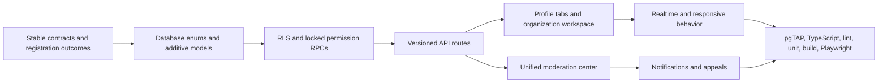

# V1 product-alignment correction

Last reviewed: 2026-07-19. This document records the correction between Step 1 and Step 2. It is intentionally explicit about integrated features versus later polish; schema-only or visual-only work is not called complete.

## Dependency graph

The organization-role enum addition is isolated in its own migration because PostgreSQL enum values must be committed before later migration statements can safely use them. All other work is additive in the following migration.

## Integrated in this correction

### Profiles

- Friend-based, Instagram-inspired profile information architecture with no follower/following fiction.
- Responsive header, verified-student context, privacy-filtered academics, biography, interests, campus, join month, counts, and contextual own/other-student actions.
- Independently loaded Posts, Listings, Events, and About tabs with bounded cursor pagination, loading, error, empty, and owner creation states.
- Visual post gallery plus complete post detail for media, caption, reactions, comments/replies, reporting, and owner edit/delete.
- Field-level controls for graduation year, academic field, friends, organization memberships, activity, and profile discovery.
- Safe projections return decisions and aggregates, never private email or raw privacy settings. Blocks, profile status, visibility, content status, and soft deletion remain authoritative.

### Organizations

- Discord/Slack-style responsive workspace with a desktop channel sidebar/member panel and mobile drawers.
- Seeded INFORMATION and GENERAL categories; authorized category/channel creation; text, announcement, and restricted channels.
- Database-enforced channel discovery/send/manage permissions, role overrides, member-override model, slow mode, unread tracking, keyset message history, replies, edit/delete/report, and RLS-filtered Realtime updates.
- Built-in Owner, Administrator, Moderator, Officer, and Member roles with explicit permission arrays and non-escalating role assignment.
- Open, approval-required, and invitation-only lifecycle: request, approve, reject, cancel, invite, accept, decline, leave, remove, ban, and unban. Ownership transfer is separately confirmed.
- Organization home with rules, campus/type, membership state, posts, events, reports, safety read-only state, and audited membership/channel changes.
- Organization, channel, message, membership, role, post, and event report targets route into the unified safety case model.

Custom role storage and channel member overrides exist as secure extension points, but custom-role creation/editing and member-override administration are not marked complete because this correction does not ship their full settings UX.

### People search

- Cards use explicit avatar, identity/metadata, and action regions. Long identity text can shrink/truncate without entering the action region.
- Tablet moves actions below identity; narrow mobile uses full-width wrapping/stacking, 44px targets, and no horizontal scrolling.
- Send, incoming accept/decline, pending cancel, friends/remove, message, and safety states share the same stable layout.

### Moderation

- Reports create campus/platform-scoped cases with queue status, severity, ownership context, protected evidence, timeline, actions, appeals, and user-visible resolution text.
- AAL2 and campus/platform role scope are checked in the trusted database path. The UI cannot widen authority.
- Profile, social, organization, marketplace, event, discussion, messaging-submission, institution, and account-security targets are represented.
- Actions require a reason and record actor, entity, case, timestamp, case event, audit event, reporter notification, and affected-subject notification where applicable.
- Supported reversible actions restore prior content/account/organization/channel/event state while preserving the original action and recording the reversal.
- Message evidence is included only when the reporting user could access and explicitly submitted that message target.

### Registration

- APIs return stable outcome codes; UI copy is mapped from the shared domain contract rather than inferred from text.
- A genuine service/configuration exception alone returns `GLOBAL_SERVICE_UNAVAILABLE`.
- Supported/open, directory-listed review, ambiguous/shared, paused campus, disabled domain, alumni domain, unsupported institution, institution mismatch, and verified-pending-review states have distinct copy.
- University of Michigan–Ann Arbor plus `umich.edu` remains fail-closed as `AMBIGUOUS_OR_SHARED_DOMAIN`; the shared mapping is not enabled to suppress an error.
- Review requests normalize and retain only approved request data and never claim that an account was created.

## Data model additions

- Profile privacy and restriction fields.
- Organization roles/assignments, categories, channels, role/member overrides, messages, read markers, audit events, and notification preferences.
- Organization profile/rules/type/read-only fields and stable membership identifiers.
- Moderation cases, case events, appeals, action target/reversal metadata, and expanded report targets/snapshots.

Every exposed table has RLS. Browser roles receive read or narrow self-update grants only; writes use authenticated, rate-limited APIs and locked functions. Definer helpers use an empty search path, fully qualified objects, internal scope checks, and revoked public execution.

## Step 2 work

- Add the dedicated authenticated Playwright fixture project described in the Step 1 plan, then cover every profile privacy/block state and organization authority persona end-to-end without production credentials.
- Complete a full custom-role editor and channel member-override settings experience before advertising either feature.
- Add channel message reactions and richer organization notification-preference settings if product validation keeps them in scope.
- Expand moderation queue facets with operator directories, saved views, related-case grouping, and appeal disposition workflows; the current core queue/action/appeal path remains authoritative.
- Add richer saved/archive management only when the backing product lifecycle is complete.

## Step 3 mobile and release work

- Build native profile tabs, organization drawers/channel list/message composer, people cards, moderation emergency review, and registration outcomes on the shared contracts and permission semantics.
- Add push delivery for organization mentions/announcements with preference and quiet-hour enforcement.
- Run device accessibility, offline/reconnect, notification deep-link, large-text, screen-reader, keyboard, and low-bandwidth suites.
- Validate Realtime reconnect/unread convergence, high-contention role changes, performance budgets, backup restore, retention, dependency scanning, and production smoke checks.
