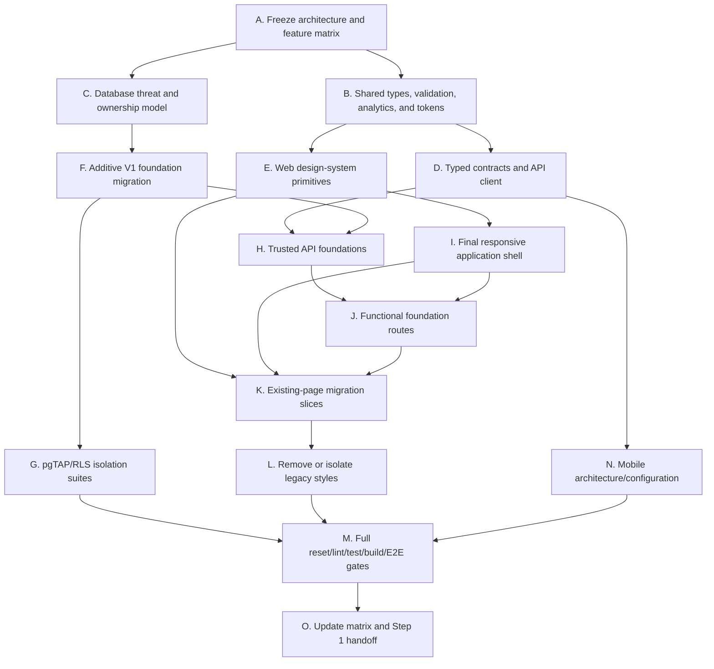

# Campus Exchange V1 Step 1 implementation plan

This plan was written after a repository-wide inventory and before changing application behavior. It is the execution record for Step 1.

## Inventory findings

### Existing architecture and features

- The monorepo contains 219 tracked application files, 12 shared-package files, 22 Supabase migration/test/config files, three architecture/operations documents, and four CI/deployment workflows.
- The web application has 43 page/layout/error/loading entry points and 59 API route handlers.
- Existing schema domains include campuses, profiles, staff roles, listings/favorites/media, events/RSVPs, message requests/conversations/messages, blocks/reports/moderation, notifications/preferences/outbox/audit/rate limits, institution registration, and a comprehensive discussions model.
- Existing verification begins green: TypeScript, ESLint, 111 Vitest tests, and 228 pgTAP assertions represented across the checked-in suites. Database and browser gates still require their runtime services.
- Security boundaries already include reviewed exact-domain registration, server-derived campus, RLS, narrow global profile projections, global blocks, same-origin JSON APIs, rate limiting, AAL2 staff checks, locked RPCs, private media, protected report snapshots, and idempotent outbox processing.

### Incomplete or missing capabilities

- Friend, organization, and social-post models do not exist.
- Search is fragmented across marketplace, people, and discussions rather than a unified trusted query.
- Profiles do not yet model academic details, interests, field-level graduation privacy, profile visibility, or complete activity sections.
- Notification rows exist, but the complete V1 category taxonomy is not shared as a typed package contract.
- Navigation omits Social and Organizations and lacks a first-class unified search surface and creation menu.
- The shared architecture contains only `contracts` and `domain`; API client, validation, design tokens, analytics, shared types, testing utilities, and mobile architecture are missing.
- The design system is a partial CSS/component layer. Only a small subset of pages imports shared UI primitives, while 148 raw form/control instances remain across 47 files.
- `globals.css` contains the legacy page-specific system and `redesign.css` overrides it, creating duplicated token, shell, button, navigation, breakpoint, and dark-theme rules.
- Automated accessibility/layout coverage exists only in the public Playwright smoke suite. Authenticated pages and a component showcase are not exercised.

### Duplicated components and technical debt

- Buttons, icon buttons, inputs, text areas, select fields, status pills, error text, empty states, dialogs, and cards are implemented through repeated class strings rather than stable typed primitives.
- Page headers use several patterns (`welcome-row`, `page-title`, `form-header`, and `PageHeader`).
- Marketplace, event, discussion, moderation, profile, and auth forms each own validation/error layout.
- Two CSS layers redefine the same selectors and depend on source order. `globals.css` is minified, page-oriented, and difficult to safely delete piecemeal.
- `app-navigation.tsx` combines navigation data, notification Realtime, focus management, responsive presentation, theme, profile, logout, and sidebar persistence in one large client component.
- API route handlers repeat authentication/origin/rate-limit/validation mechanics despite shared helpers.
- The current lint command uses deprecated `next lint`; migration to direct ESLint is required before Next.js 16.
- Some docs contain mojibake punctuation inherited from earlier text conversion; touched documentation/UI copy should be normalized.

## Migration risks and mitigations

| Risk | Impact | Mitigation and verification |
| --- | --- | --- |
| Broad new cross-campus reads | Student data leakage | Keep base profile/content tables RLS-restricted; expose narrow safe RPC results; test two campuses plus blocks and suspension. |
| Relationship state races | Duplicate or contradictory friendships/memberships | Canonical pair keys, partial unique indexes, row locks in deterministic order, transactional RPCs, and concurrent/idempotency tests. |
| Organization role escalation | Unauthorized administration | Rank roles server-side, forbid self-promotion and peer/higher-role management, protect the owner, require transfer RPC, and pgTAP every role boundary. |
| Social visibility drift | Campus/friends/private content leakage | One shared database visibility predicate, indexed ownership/visibility/status columns, block precedence, and RLS matrix tests. |
| Definer/RPC misuse | RLS bypass | Prefer invoker; place necessary implementations in `private`, set empty search path, qualify every object, validate identity/scope, revoke `PUBLIC`, and run database lint/advisors. |
| Data API privilege changes | Tables unavailable or overexposed | Explicit per-table grants after RLS; never rely on automatic exposure defaults. |
| Large migration reset time | CI instability | Additive forward migration, bounded seed fixtures, indexes after table creation, no destructive rewrite of existing large tables. |
| Notification fan-out duplicates | Duplicate notifications/email | Deterministic event/recipient/category keys, unique constraints, transactional outbox insertion, worker idempotency tests. |
| CSS big-bang replacement | Regressions across 43 pages | Introduce tokens/primitives first, migrate by vertical slice, run type/unit/build per slice, isolate legacy selectors until the last consumer moves. |
| Navigation links before features | Dead navigation | Add only routes with a functional foundation screen and working actions; no placeholder pages or disabled affordances. |
| Shared-package circularity | Build or mobile coupling | Dependency direction: shared-types -> validation/tokens/analytics; contracts -> shared-types/validation; domain -> contracts/shared-types; api-client -> contracts/shared-types. No package imports from apps. |
| Authenticated E2E fixtures | Brittle or unsafe tests | Use local seeded synthetic campuses/users only, never production credentials; separate public and authenticated projects. |
| Existing untracked work | Accidental data loss | Do not modify or stage `.codex-security-work/` or unrelated user changes. Stage explicit files per checkpoint. |

## Task graph

## Execution slices and checkpoint commits

1. **Architecture freeze**
   - Deliver these three documents and update README links.
   - Commit: `docs: freeze Campus Exchange V1 architecture`.

2. **Shared mobile-ready foundation**
   - Add `shared-types`, `validation`, `design-tokens`, `analytics`, `api-client`, and `testing` packages.
   - Add `apps/mobile` architecture/configuration without React Native UI.
   - Extend contracts and OpenAPI conventions; add type/contract/unit tests.
   - Commit: `feat: add shared V1 platform foundations`.

3. **Database and trusted API foundation**
   - Create a Supabase CLI-generated additive migration for expanded profiles, friends, organizations, social posts/reactions/comments, unified search, and notification taxonomy.
   - Enable RLS and explicit grants; add narrow RPCs and indexes; preserve blocks, campus/network visibility, and staff MFA.
   - Add pgTAP relationship, role-escalation, visibility, blocking, and cross-campus isolation tests.
   - Add versioned API foundation routes using shared contracts/client error conventions.
   - Commit: `feat: establish V1 social data and API foundations`.

4. **Design system and information architecture**
   - Promote all tokens to the shared package/CSS adapter.
   - Build accessible primitives and domain cards with states; add a development-only or test-only component harness rather than a production dead route.
   - Refactor the responsive shell into focused navigation, utilities, account, and context components.
   - Add functional Social, Organizations, Search, friend-request, and creation entry routes backed by real APIs; no mock data or dead controls.
   - Commit: `feat: deliver the V1 design system and navigation`.

5. **Page migration**
   - Migrate public/auth, home/marketplace/listings, events/discussions, messages/notifications/search, profiles/settings/safety, and staff pages in passing vertical slices.
   - Standardize headers, forms, loading, errors, empty states, confirmations, and responsive layout.
   - Remove `redesign.css` layering and retain any unavoidable old selectors in a clearly named temporary legacy file with zero route-level consumers at Step 1 completion.
   - Commit: `refactor: migrate web experiences to the V1 system`.

6. **Completion gates**
   - Run clean database reset, database lint, pgTAP, typecheck, ESLint, unit/contract tests, production build, desktop/mobile/accessibility Playwright, and dependency audit.
   - Update the feature matrix only from verified evidence.
   - Commit: `test: complete Step 1 release verification`.

## Definition of done

Step 1 is done only when the requested architecture and matrix exist; all existing web routes use the final shell and semantic tokens; no route has placeholder/mock-only actions; shared packages and mobile configuration build; the new data models, RLS, contracts, and API foundations work; block/campus/role/visibility isolation is tested; any proven route-specific compatibility selectors are isolated behind a documented boundary that new work cannot extend; and every repository gate in CI passes from a clean checkout and reset.

## Execution record

- `933b312` froze the architecture, permissions, journeys, visibility model, feature matrix, and task graph before application changes.
- `d4f0e15` added the platform-neutral shared packages and mobile architecture boundary.
- `813c834` added expanded profile, mutual-friend, organization, social, unified-search, media, notification, RLS, and trusted API foundations without broadening existing campus-private access.
- The design-system slice promotes semantic tokens to `packages/design-tokens`, provides server and interactive accessible primitives, separates the navigation model from runtime behavior, and connects the global creation menu to real product flows.
- The web lint gate now runs ESLint 9 directly through a flat compatibility configuration, removing the deprecated `next lint` command before the Next.js 16 transition.
- Route-specific compatibility selectors are isolated behind `legacy-compat.css` and inherit shared semantic tokens. `redesign.css` is the final shell/component layer; new feature work may not extend the compatibility boundary.
- The final release-gate results are recorded after clean database, type, lint, unit, build, and Playwright validation rather than inferred from implementation.

## Final Step 1 verification (2026-07-18)

| Gate | Result |
| --- | --- |
| Clean local database reset | Passed; all forward migrations replayed through `20260718225155_optimize_notification_preferences_rls.sql`. |
| Database lint | Passed with zero errors in `public` and `private`. |
| pgTAP | Passed: 6 files, 294 assertions. |
| Local database advisors | No security errors; only the three documented performance warnings for separate owner/staff update policies on listings, events, and media. |
| TypeScript | Passed across all 11 buildable workspaces. |
| ESLint | Passed with zero warnings through the direct ESLint 9 gate. |
| Unit and contract tests | Passed across web, worker, contracts, domain, and shared packages. |
| Production build | Passed for the worker dry run, web, mobile architecture, and all shared packages; Next generated 50 pages. |
| Playwright | Passed: 12 desktop/mobile tests including serious/critical axe, overflow, registration controls, dark theme, and keyboard focus. |
| Production dependency audit | Passed with no known vulnerabilities at moderate or higher severity. |

The advisor-driven notification-preference RLS migration wraps `auth.uid()` in scalar subqueries so PostgreSQL initializes the subject once per statement. Existing self-read/write RLS behavior remains covered by pgTAP; the migration removed all three notification-preference advisor warnings without weakening authorization.
